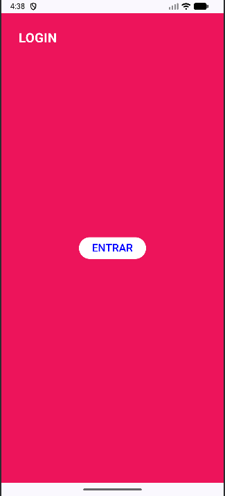
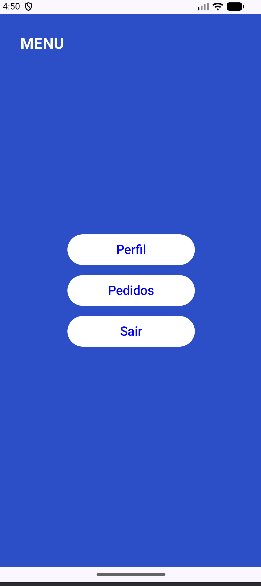
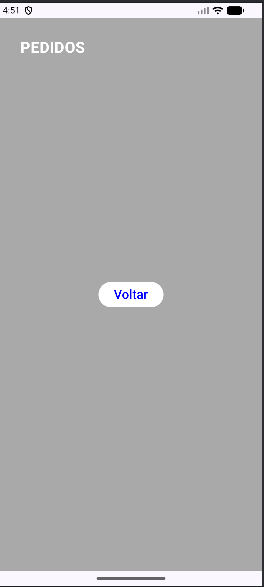
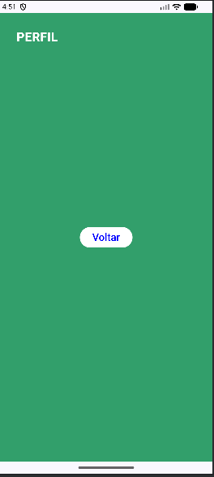

# Projeto Android - Navegando entre telas

Lucas Rodrigues Alves - RM: 555377
## Descrição do Projeto
Nesse projeto aprendemos a funcionalidade de navegação entre telas usando o Jetpack Compose e Navigation Compose.
Além de treinarmos a criação e layout de outras telas.

## Prints do projeto

### Login

### Menu

### Pedidos

### Perfil

